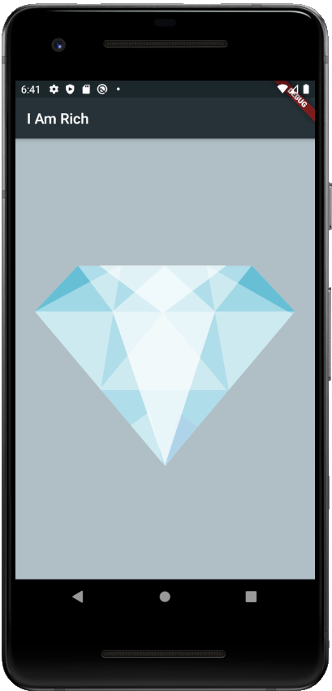

# I Am Rich

This is a Flutter app I worked on following the starter code from the Flutter Udemy course by Angela Yu.

It just displays an image of a diamond.

Skills learned:

1. General feel of Flutter
2. Using NetworkImage and AssetImage

## Screenshot

